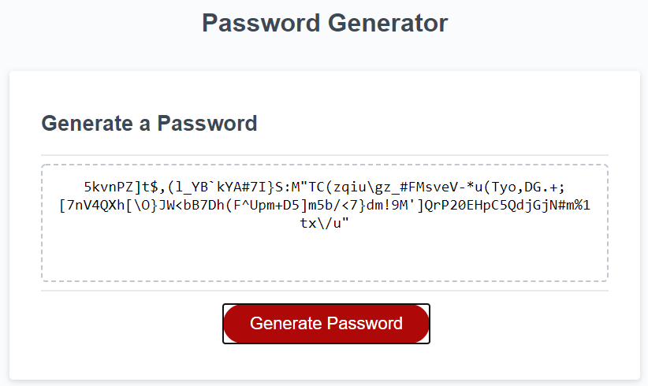

# FSB-PasswordGenerator

## Purpose:
The purpose of this program is to randomly generate a password that follows the following criteria:
<ul>
    <li>User can set their own password length</li>
    <li>User can choose to add characters from the following</li>
    <ul>
        <li>Lowercase Characters</li>
        <li>Uppercase Characters</li>
        <li>Numerical Characters</li>
        <li>Special Characters</li>
    </ul>
</ul>

## Language used:
Primarily JavaScript for the functionality, main page is HTML with a CSS for the styling

### Psuedo example:

User is prompted for a numerical input between 8 and 128 (inclusively).
Validation is run to make sure that their input is between 8 and 128, and also only numbers have been entered.

User is then prompted 4 times, once for each character set (mentioned above).
Based on the return of the prompts, an array is generated containing all selected character sets.

Once the above has been completed, a random number is generated based on the total length of the previously generated array, and the index value is stored in a string via concatenation.

The final password is then returned to be displayed on the main page.

#### Live website link:
https://grimmedev.github.io/FSB-PasswordGenerator/

#### Example image:

##### License
The MIT License
Copyright (c) 2020 Robert Grimes

Permission is hereby granted, free of charge, to any person obtaining a copy of this software and associated documentation files (the "Software"), to deal in the Software without restriction, including without limitation the rights to use, copy, modify, merge, publish, distribute, sublicense, and/or sell copies of the Software, and to permit persons to whom the Software is furnished to do so, subject to the following conditions:

The above copyright notice and this permission notice shall be included in all copies or substantial portions of the Software.

THE SOFTWARE IS PROVIDED "AS IS", WITHOUT WARRANTY OF ANY KIND, EXPRESS OR IMPLIED, INCLUDING BUT NOT LIMITED TO THE WARRANTIES OF MERCHANTABILITY, FITNESS FOR A PARTICULAR PURPOSE AND NONINFRINGEMENT. IN NO EVENT SHALL THE AUTHORS OR COPYRIGHT HOLDERS BE LIABLE FOR ANY CLAIM, DAMAGES OR OTHER LIABILITY, WHETHER IN AN ACTION OF CONTRACT, TORT OR OTHERWISE, ARISING FROM, OUT OF OR IN CONNECTION WITH THE SOFTWARE OR THE USE OR OTHER DEALINGS IN THE SOFTWARE.